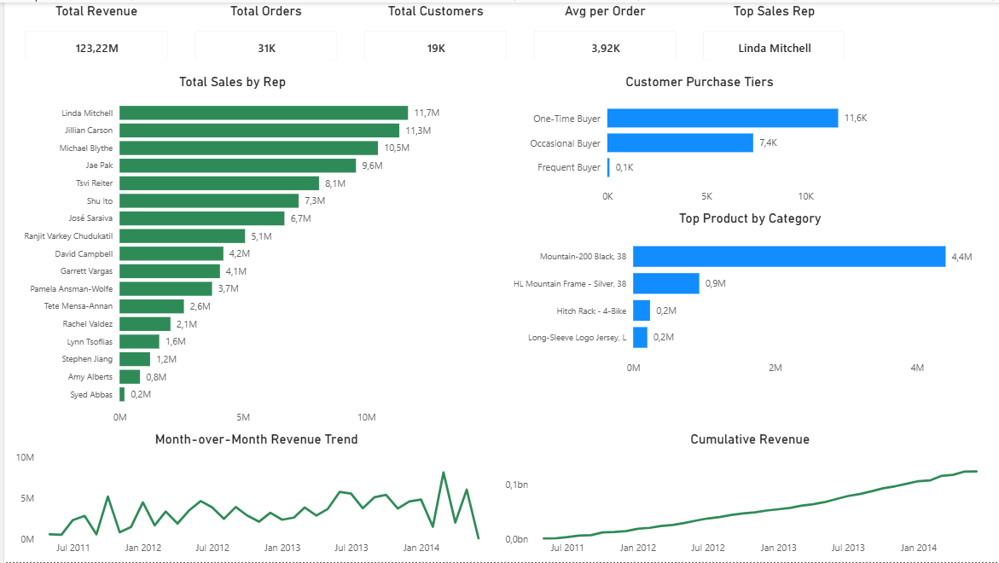
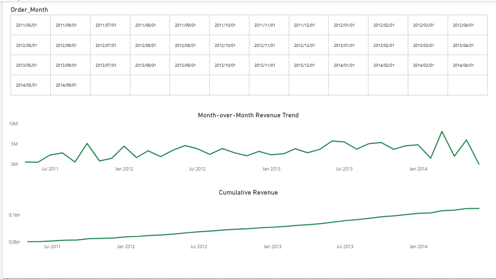

# Sales & Employee Performance Analysis

Advanced SQL analysis and Power BI dashboard built on the AdventureWorks2019 database, focused on sales rep performance, revenue trends, product performance, and customer segmentation.

This is the second project in a portfolio built during a transition from Supply Chain & Logistics operations into Data Analytics, leveraging 15+ years of operational business context alongside newly developed SQL and BI technical skills.

---

## Project Overview

**Business narrative:** Acting as a data analyst supporting a sales director, this project answers six core business questions — who the top performing sales reps are, how revenue is trending month over month, which products and categories drive the most value, and how customers can be segmented by purchase frequency — culminating in a single-view executive summary.

**Dataset:** AdventureWorks2019 (Microsoft sample OLTP database)
**Tools:** SQL Server Management Studio (T-SQL), Power BI Desktop

---

## Techniques Demonstrated

| Technique | Where Used |
|---|---|
| `RANK()` / `DENSE_RANK()` | Query 1 |
| CTEs (Common Table Expressions) | Queries 2, 3, 4, 5 |
| `LAG()` | Query 2 |
| `SUM() OVER()` (running totals) | Query 3 |
| `ROW_NUMBER()` with `PARTITION BY` | Query 4 |
| Multi-table joins with `LEFT JOIN` for data integrity | Query 4 |
| `CASE WHEN` segmentation logic | Query 5 |
| Scalar subqueries | Query 6 |

---

## SQL Queries

All queries are available in [`/SQL`](./SQL).

### Query 1 — Sales Rep Revenue Ranking
Ranks all 17 sales reps by total revenue using `RANK()` and `DENSE_RANK()`.
**Finding:** Linda Mitchell is the top performer at $11.7M, with a clear drop-off after the top 8 reps.

### Query 2 — Month-over-Month Revenue Trend
Uses a CTE to aggregate monthly revenue, then `LAG()` to calculate month-over-month dollar and percentage change.
**Finding:** Revenue is highly volatile month to month (swings exceeding ±80% in places). The final month in the dataset (June 2014) shows a near-complete drop, indicating an incomplete trading month rather than a genuine business event — a data quality flag worth raising with stakeholders before including it in trend reporting.

### Query 3 — Cumulative Revenue
Uses `SUM() OVER (ORDER BY ...)` to build a running revenue total across the full date range.

### Query 4 — Top Product per Category
Joins `SalesOrderHeader` through `SalesOrderDetail`, `Product`, `ProductSubcategory`, and `ProductCategory`, then uses `ROW_NUMBER() OVER (PARTITION BY Category)` to identify the top-selling product within each category.
**Data quality note:** Some products in the `Product` table have no assigned subcategory. Investigation via a targeted `COUNT` query confirmed none of these uncategorised products appear in actual sales orders, so a defensive `LEFT JOIN` with `ISNULL()` labelling was used to preserve query robustness without affecting results.

### Query 5 — Customer Purchase Frequency Tiers
Segments all 19,119 customers into One-Time, Occasional, and Frequent buyer tiers using a CTE and `CASE WHEN` logic based on order count.
**Finding:** 11,649 customers (61%) are one-time buyers, 7,361 (38%) are occasional buyers, and only 109 (under 1%) are frequent repeat customers — highlighting a clear retention opportunity.

### Query 6 — Executive Summary
A single-row snapshot combining five scalar subqueries: total revenue, total orders, total customers, average order value, and top sales rep.

---

## Power BI Dashboard

Two-page interactive report: [`/PowerBI/Project2_Sales_Employee_Performance.pbix`](./PowerBI)

### Page 1 — Overview
KPI cards (Total Revenue, Total Orders, Total Customers, Avg Order Value, Top Sales Rep), sales rep ranking, customer purchase tiers, top product by category, and revenue trend charts.



### Page 2 — Revenue Trend Detail
Interactive month-range slicer filtering both the Month-over-Month and Cumulative Revenue charts.



**Design convention:** Green is used for financial metrics (revenue, trends), blue for operational metrics (products, customer segments) — consistent with the colour convention established in Project 1.

---

## Key Business Insights

- Revenue is concentrated among a small group of top sales reps, with Linda Mitchell generating roughly double the revenue of the lowest-ranked rep in the top 10.
- The business has a heavy reliance on one-time customers (61% of the customer base), with very few customers reaching frequent-buyer status — a strong candidate for a retention or loyalty initiative.
- Mountain bike products significantly outperform other categories, with the Mountain-200 Black generating over $4M in revenue alone.
- Month-over-month revenue is volatile, suggesting seasonality or order-timing effects that would benefit from further investigation.

---

## Repository Structure

```
/SQL                  All six T-SQL queries (.sql files)
/PowerBI               Power BI dashboard file (.pbix)
/Screenshots            Dashboard page exports (.png)
README.md             This file
```

---

## About This Project

Built as part of a structured transition from Supply Chain & Logistics operations into Data Analytics. See also: [Project 1 — Supply Chain Performance Analysis](https://github.com/jurgensp09-ship-it/Supply-Chain-SQL-Analysis/tree/main)
